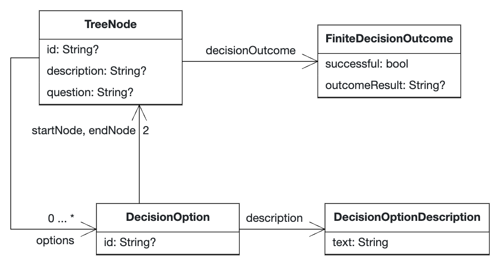

# Digital assistance for victims of crimes

## Domain model


A TreeNode represents a node in the tree. It might have a FiniteDecisionOutcome and multiple DecisionOptions that can be taken from that TreeNode. A DecisionOption is an option that "connects" two TreeNodes and represents a possible option that leads from startNode to endNode. In addition, a DecisionOption has a DecisionOptionDescription. Currently, this only contains a textual representation, but might be extended with Markdown/Images.

[Apollon Edit-Link](https://apollon.ase.in.tum.de/6XIr1wSP3LB8t1jTxDIH?view=COLLABORATE)

## Data model

The data is split into two different JSON-files to avoid redundancy.

The first file holds information about the nodes, but not about the relationship (decision options in context) to other notes. Some important notes:

- "id" (mandatory): Unique identifier of the node, used for matching.
- "isRoot" (optional): Exactly one node must have "isRoot" set to true. This is the root node of the tree.
- "description" (optional): A description.
- "question" (optional): A question on the current node. Might be null, if no options are available.
- "outcome" (optional): The (finite) outcome of a note.

```json
[
  {
    "id": "n0",
    "isRoot": true,
    "description": "Beschreibung",
    "question": "Wurde dir körperlicher/geistiger Schaden zugefügt?"
  },
  {
    "id": "n1.1",
    "description": "Beschreibung",
    "question": "Mit einem Gegenstand?"
  },
  {
    "id": "n1.2",
    "description": "Beschreibung",
    "outcome": { "successful": false }
  },
  {
    "id": "n2.1",
    "description": "Beschreibung",
    "outcome": {
      "successful": true,
      "outcomeResult": "Schwere Körperverletzung"
    }
  }
]
```

The second file holds information about the relationship between nodes, i.e. the decision options:

- "id" (required): Unique identifier of the option, required for matching.
- "startNodeId" (required): ID of the node from which the option can be taken from.
- "endNodeId" (required): ID of the node that chosing this option leads to.
- "description" (required): (Textual) description of the option.

```json
[
  {
    "id": "op1.1",
    "startNodeId": "n0",
    "endNodeId": "n1.1",
    "description": {
      "text": "Ja"
    }
  },
  {
    "id": "op1.2",
    "startNodeId": "n0",
    "endNodeId": "n1.2",
    "description": {
      "text": "Nein"
    }
  }
]
```


## Natural language processing model (NLP)
We used an GPT-3 as a natural language processing model to classify the input text of the user into our 5 top level nodes: Schuldunfähigkeit,Körperverletzung, Sexualstraftaten, Notwehr, Verjährungsfrist. The model is trained on 127 examplitory prompts that contain 5-8 keywords for each node and was trained with the Few-shot (FS) method.

|    Class           |    Keyword        
| ------------- |:-------------:| 
| Schuldunfähigkeit     | Alter,Minderjährigkeit, Unzurechnungsfähigkeit, geistige Beeinträchtigung, psychische Erkrankung, Strafminderung, Schuldfähigkeit, Unmündigkeit, Strafmindernde Schuldunfähigkeit, Schuldunfähigkeit durch Unmündigkeit | 
| Notwehr    | Selbstverteidigung, Notstand, Nothilfe, Gewaltanwendung, Angriff      |  
| Sexualstraftaten | Vergewaltigung, sexueller Missbrauch, sexuelle Belästigung, sexuelle Nötigung, sexueller Übergriff     |  
| Körperverletzung |Schläge, Verletzungen, Misshandlung, Gewalt, Angriff    |   
| Verjährungsfrist | Verjährung, Fristen, Verjährungsfristen, Strafverfolgung, Verjährungsbeginn    |    

We used the davinci model, since it is the most capable for NLP tasks.The model is hosted on the OpenAI API and can be accessed [here](https://api.openai.com/v1/engines/davinci/completions). We call the model with the following parameters: 
```json
{
  "prompt": "<USER_INPUT>",
  "model": "<FINE_TUNED_MODEL>",
  "max_tokens": 9,
  "temperature": 0,
  "top_p": 1,
  "n": 1,
  "logprobs": null,
}
```
Prompt is the user input, in the beginning of the conversation, that is classified into one of the 5 classes. The model parameter is the fine-tuned model we created.
OpenAi works with tokens, which are the smallest units of text. The max_token parameter is set to 9, since Schuldunfähigkeit is the longest class name and has 9 tokens. This can be checked [here](https://beta.openai.com/tokenizer). The temperature parameter determines the randomness of the model, the higher the temperature, the more random the model is. We set it to 0,since we want to get the most likely class. Top_p determines the probability mass that the model considers to choose the next token. Top_p is set to 1, since we want to get the most likely class. The n paramter defines the number of classes that are returned. We only want to get the most likely class, so it is set to 1. Logprobs defines if the log probabilities of the returned classes are returned. We do not need the log probabilities, so it is set to null. 

To validate the model we can use the validation jsonl file and get a generated result file of the classifications. 
```bash
openai api fine_tunes.create \
  -t <TRAIN_FILE_ID_OR_PATH> \
  -v <VALIDATION_FILE_OR_PATH> \
  -m <MODEL> \
  --compute_classification_metrics \
  --classification_n_classes 5
  ```
The results of the classification can be found in the result/ folder.


### Steps to reproduce
A documentation of the fine-tuning process can be found [here](https://beta.openai.com/docs/guides/fine-tuning). 

1. Install the OpenAI API: 
```bash
pip install --upgrade openai
```
2. Get an API key from OpenAI [here](https://beta.openai.com/docs/api-reference/authentication) and set up an enviroment variable: 
```bash
export OPENAI_API_KEY="<OPENAI_API_KEY>"
```
3. Convert the training data json into a jsonL file: 
```bash
openai tools fine_tunes.prepare_data -f trainings_data.json 
```
This generates a training and validation jsonl file out of the training data json file.
4. Fine-tune the model with the training jsonl file: 
```bash
openai api fine_tunes.create -t trainings_data_prepared_train.jsonl -m davinci
```
OpenAi offers 4 base models: ada, babbage, curie, davinci. The model are different in their capabilities andthere is a tradeoff between performance and price. 
The fine-tuned model is saved in the OpenAI API.
5. Now the model can be used to classify the user input into one of the 5 classes over the [Completions API](https://beta.openai.com/docs/api-reference/completions/create).


